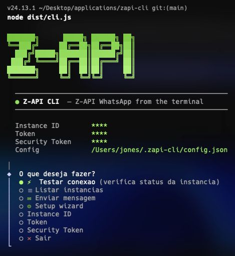

# zapi-cli

> **Aviso:** Esta es una herramienta **no oficial**, creada por la comunidad. **No tiene ningun vinculo, respaldo ni asociacion con Z-API.** Usela bajo su propia responsabilidad.

**[Portugues](README.md) | [English](README.en.md)**

Una interfaz de linea de comandos para la API de WhatsApp de [Z-API](https://z-api.io). Administre su instancia, envie mensajes, gestione grupos, contactos, webhooks y mucho mas — todo desde la terminal.

## El problema

Z-API expone una API REST poderosa para automatizacion de WhatsApp. Pero interactuar con ella significa lidiar con comandos `curl`, recordar paths de endpoints, armar payloads JSON y construir URLs con IDs y tokens de autenticacion manualmente.

**zapi-cli** encapsula toda la superficie de Z-API en un unico binario con:

- Un **menu interactivo** para operaciones rapidas (probar conexion, enviar mensaje, ver QR code)
- Una **CLI completa** con subcomandos para scripts y automatizacion (`zapi send text --to 5411... --message "hola"`)
- Un **wizard de configuracion** que guarda el ID y los tokens de la instancia una sola vez
- **Auto-actualizacion** integrada — ejecute `zapi update` en cualquier momento

No mas copiar y pegar tokens en URLs o consultar la documentacion en cada request.



## Instalacion

Un solo comando:

```bash
curl -fsSL https://raw.githubusercontent.com/jonesfernandess/zapi-cli/main/install.sh | bash
```

El script verifica Node.js 18+ y npm, clona el repositorio en `~/.zapi-cli-app`, compila e instala el comando `zapi` globalmente.

**Requisitos:** Node.js 18+, npm, git.

## Inicio rapido

```bash
# 1. Instalar
curl -fsSL https://raw.githubusercontent.com/jonesfernandess/zapi-cli/main/install.sh | bash

# 2. Configurar — abre el wizard de setup
zapi setup

# 3. Probar la conexion
zapi instance status

# 4. Enviar su primer mensaje
zapi send text --to 5411999999999 --message "Hola desde la terminal!"
```

O simplemente ejecute `zapi` sin argumentos para abrir el menu interactivo.

## Actualizacion

Actualice a la version mas reciente en cualquier momento:

```bash
zapi update
```

`zapi upgrade` tambien funciona. El comando descarga el codigo mas reciente de GitHub, reinstala dependencias y recompila automaticamente.

## Uso

### Modo interactivo

Ejecute `zapi` sin argumentos:

```
  Z-API CLI — WhatsApp API from the terminal

  ● Que desea hacer?
  ● ⚡ Probar conexion      (verifica status de la instancia)
  ○ ✉  Enviar mensaje       (envio rapido de texto)
  ○ 📱 QR Code              (conectar instancia)
  ○ ⚙  Setup wizard
  ○ ✕  Salir
```

### Modo CLI

Para scripts y automatizacion:

```
zapi [comando] [subcomando] [opciones]
```

### Comandos

| Comando | Descripcion |
|---------|-------------|
| `instance` | Administrar instancia WhatsApp (conectar, desconectar, status, QR code) |
| `send` | Enviar mensajes (texto, imagen, video, audio, documento, sticker, GIF, ubicacion, contacto, PIX, encuesta, carrusel) |
| `message` | Administrar mensajes (eliminar, leer, responder, reaccionar, reenviar, fijar) |
| `chat` | Administrar conversaciones (listar, archivar, silenciar, fijar, limpiar, eliminar) |
| `group` | Administrar grupos de WhatsApp (crear, participantes, admin, metadatos) |
| `contact` | Administrar contactos (listar, verificar WhatsApp, bloquear, foto de perfil) |
| `webhook` | Configurar webhooks |
| `newsletter` | Administrar Canales de WhatsApp |
| `business` | Productos, etiquetas, catalogo |
| `status` | Publicar Stories en WhatsApp |
| `community` | Administrar comunidades |
| `queue` | Gestion de cola de mensajes |
| `privacy` | Configuraciones de privacidad |
| `partner` | Operaciones de socio/admin |
| `calls` | Realizar llamadas en WhatsApp |
| `setup` | Wizard de configuracion interactivo |
| `update` | Actualizar a la version mas reciente |

### Ejemplos

```bash
# Verificar status de la instancia
zapi instance status

# Obtener QR code para conectar
zapi instance qr

# Enviar mensaje de texto
zapi send text --to 5411999999999 --message "Hola!"

# Enviar imagen
zapi send image --to 5411999999999 --url https://ejemplo.com/foto.jpg

# Enviar documento
zapi send document --to 5411999999999 --url https://ejemplo.com/archivo.pdf

# Enviar encuesta
zapi send poll --to 5411999999999 --title "Cual es la mejor opcion?" --options "A,B,C"

# Publicar un Story en WhatsApp
zapi status text --message "Novedad!"

# Configurar webhook
zapi webhook set --url https://su-servidor.com/webhook

# Listar todos los grupos
zapi group list

# Ayuda de cualquier comando
zapi send --help
zapi instance connect --help
```

## Configuracion

En la primera ejecucion, el wizard crea `~/.zapi-cli/config.json`:

```json
{
  "instanceId": "SU-INSTANCE-ID",
  "token": "SU-TOKEN-DE-INSTANCIA",
  "securityToken": ""
}
```

| Campo | Descripcion |
|-------|-------------|
| `instanceId` | ID de la instancia Z-API |
| `token` | Token de la instancia |
| `securityToken` | Token de seguridad (opcional, para validacion de webhooks) |

La autenticacion en Z-API se realiza via path de la URL (`/instances/{instanceId}/token/{token}/...`), sin headers adicionales.

Puede reconfigurar en cualquier momento con `zapi setup` o cambiar valores individuales desde el menu interactivo.

## Build local

```bash
git clone https://github.com/jonesfernandess/zapi-cli.git
cd zapi-cli
npm install
npm run build
npm install -g .
```

### Desarrollo

```bash
npm run dev      # Ejecutar con tsx (sin build)
npm run build    # Compilar TypeScript a dist/
npm run lint     # Verificar tipos sin emitir archivos
```

## Stack

- **TypeScript** + **Commander.js** para el framework CLI
- **@clack/prompts** para el menu interactivo
- **chalk** + **gradient-string** + **figlet** para estilos en la terminal

## Star History

[](https://star-history.com/#jonesfernandess/zapi-cli&Date)

## Licencia

MIT
